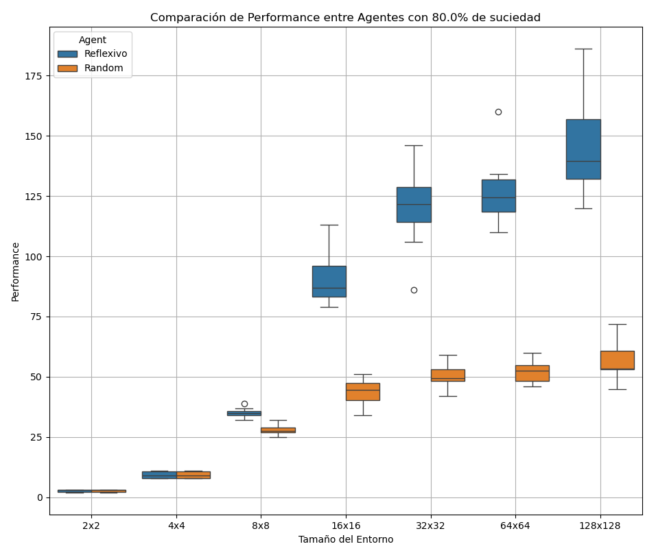

# Introducción
El objetivo de este proyecto es implementar una simulacion que determine la medida de rendimiento de distintos agentes en el entorno de la 'aspiradora'. A continuación vamos a medir y comparar el desempeño de un agente reflexivo simple y de un agente aleatorio.

## Marco Teórico

El PEAS (Performance, Enviorment, Actions, Sensors) del problema me dicen que existe una metrica para medir el rendimiento, un entorno sobre el cual se va a realizar la prueba y los agentes que pueden tomar las acciones en base a los datos dados por los sensores.

- **Medida de rendimiento**: Cantidad de casillas limpiadas.
- **Entorno**: Grilla de celdas, parcialmente observable, con suciedad o limpieza aleatoria.
- **Acciones**: El Agente puede moverse, Arriba, Abajo, Izqu
ierda, Derecha. Y este puede limpiar o decidir no hacer nada
- **Sensores**: Sensor para determinar si la casilla en la que se encuentra esta sucia o no.

Cualidades del entorno:
- Se generan las casillas con suciedad de forma aleatoria.
- La suciedad no se regenera una vez limpiada.
- Los agentes comienzan en un casillero aleatorio del entorno.

## Diseño experimental

Esta comparacion ha sido realizada en un entorno con las siguientes caracteristicas:
- **Entornos**: 2x2, 4x4, 8x8, 16x16, 32x32, 64x64, 128x128
- **Porcentajes de suciedad**: 0.1, 0.2, 0.4, 0.8

Caracteristicas de los agentes: Se dividen en dos tipos de agentes
- **Agente aleatorio**: realiza una opcion de manera aleatoria en su entorno sin verificar si el casillero en el que esta presente esta limpio o no.
- **Agente reflexivo simple**: Similar al anterior pero puede sensar si la casilla en la que se encuentra esta sucia o no, para saber si limpiar o no hacer nada.
- Ambos poseen una cantidad limite de 1000 acciones.

Las pruebas fueron repetidas un total de 10 veces en cada combinacion entorno-suciedad, con la disposicion de esta suciedad de forma completamente aleatoria alrederor del entorno, sin embargo, para poder realizar una comparacion correcta del rendimiento este entorno aleatoriamente generado ha sido el mismo para ambos agentes.

Los experimentos fueron llevados a cabo en Python, utilizando "Objetos" para representar tanto los entornos como los agentes

## Analisis y discusion de los resultados

Para el presente analisis, lo primero que se ha realizado fueron los graficos del performance promedio que tuvo cada agente según su entorno y el porcentaje de suciedad.

 

Ambos agentes funcionan igual de bien en espacios pequeños y esto se debe a que es fácil elegir qué hacer en dichas áreas. En entornos a gran escala, el agente con un enfoque reflexivo demuestra consistentemente un rendimiento superior en comparación con el agente que opera aleatoriamente.

En los entornos 2x2 y 4x4 se observa un rendimiento aparentemente identico.

pero al observar la cantidad de iteraciones se puede observar una diferecia. Ambos agentes funcionan igual de bien en estos entornos, pero no significa que sean igual de eficaces. 

En el entorno 2x2, ambos agentes alcanzaron su máximo rendimiento sin realizar ningun movimiento, ya que no hay casillas sucias. En cambio, en el entorno 4x4 con un 10% de suciedad, el Agente reflexivo simple limpia el entorno en menos de 400 acciones, mientras que al agente aleatorio le toma alrededor de 500 acciones. Esto nos dice que mientras los dos agentes pueden limpiar, el agente reflexivo lo hace con menos acciones. 

También podemos usar gráficos de cajas y bigotes para analizar algunos casos particulares.

El Agente reflexivo muestra mayor versatilidad en su desempeño en entornos más grandes, lo que se refleja en que considera la caja como más amplia en esos contextos. El agente aleatorio tiene una caja pequeña que siempre es la misma, lo que significa que su capacidad de limpieza es limitada en todos los lugares. Su rendimiento es uniforme y no varía mucho.

## Conclusiones

Podemos concluir que aunque los agentes reflexivo y aleatorio tienen un rendimiento similar en entornos pequeños, a medida que este aumenta, el agente reflexivo nos muestra una clara superioridad a comparacion del agente aleatorio, sin importar el porcentaje de suciedad. En entornos grandes, el agente reflexivo además de lograr una mejor performance promedio, también lo hace con mayor eficiencia, requiriendo un número menor acciones para limpiar el entorno.