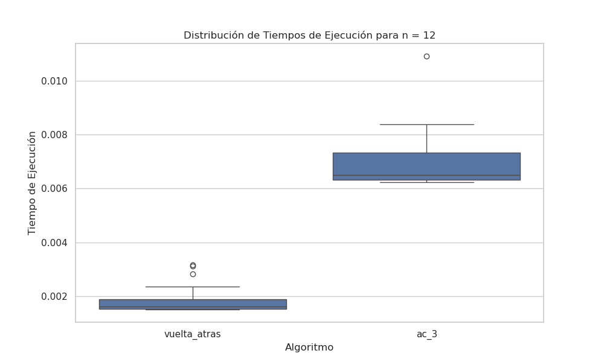

# Trabajo Práctico 6: Satisfacción de restricciones 

### 1) Describir en detalle una formulación CSP para el Sudoku

En una formulación CSP para Sudoku, las variables corresponden a cada celda del tablero. El dominio de cada variable es el conjunto {1, 2, ..., 9}. Las restricciones imponen la unicidad de los valores en cada fila, columna y subcuadrícula, asegurando así la solución única del puzzle.

### 2) Utilizar el algoritmo AC-3 para demostrar que la arco consistencia puede detectar la inconsistencia de la asignación parcial WA=red, V=blue para el problema de colorear el mapa de Australia.

#### Solución con AC-3 para detectar inconsistencia en la asignación parcial

**Asignación parcial inicial:**

- \( WA = \text{red} \)
- \( V = \text{blue} \)

**Dominios iniciales de los otros estados:**

- \( NT = \{ \text{red}, \text{green}, \text{blue} \} \)
- \( SA = \{ \text{red}, \text{green}, \text{blue} \} \)
- \( Q = \{ \text{red}, \text{green}, \text{blue} \} \)
- \( NSW = \{ \text{red}, \text{green}, \text{blue} \} \)

**Paso 1: Propagación de restricciones**

- Eliminar **red** de \( NT \) y \( SA \) (por \( WA = \text{red} \)).
- Eliminar **blue** de \( SA \) y \( NSW \) (por \( V = \text{blue} \)).

**Dominios actualizados:**

- \( NT = \{ \text{green}, \text{blue} \} \)
- \( SA = \{ \text{green} \} \)
- \( Q = \{ \text{red}, \text{green}, \text{blue} \} \)
- \( NSW = \{ \text{red}, \text{green} \} \)

**Paso 2: Revisión de arcos**

- \( SA \) solo puede ser **green**, lo que implica:
  - Eliminar **green** de \( NT \) y \( NSW \).

**Dominios actualizados:**

- \( NT = \{ \text{blue} \} \)
- \( NSW = \{ \text{red} \} \)

**Paso 3: Detección de inconsistencia**

- \( NT \) solo puede ser **blue**, lo que implica eliminar **blue** de \( Q \).
- Si \( Q \) se revisa, su dominio queda \( \{ \text{red}, \text{green} \} \).

**Resultado:**
El algoritmo AC-3 muestra que, al propagar las restricciones, no todos los estados pueden asignarse de forma consistente. La asignación parcial \( WA = \text{red} \) y \( V = \text{blue} \) es inconsistente porque los dominios de algunos estados se reducen de forma que violan las restricciones de adyacencia.

### 3) ¿Cuál es la complejidad en el peor caso cuando se ejecuta AC-3 en un árbol estructurado CSP? (i.e. cuando el grafo de restricciones forma un árbol: cualquiera dos variables están relacionadas por a lo sumo un camino).

En un árbol, las conexiones entre los nodos son claras y directas. Esto significa que el algoritmo AC-3 solo necesita revisar cada conexión una vez, lo que resulta en una eficiencia de O(ED), donde E es el número de conexiones y D el número máximo de posibles valores para cada nodo.

### 4) AC-3 coloca de nuevo en la cola todo arco (Xk, Xi) cuando cualquier valor es removido del dominio de Xi incluso si cada valor de Xk es consistente con los valores restantes de Xi. Supongamos que por cada arco (Xk, Xi) se puede llevar la cuenta del número de valores restantes de  Xi que sean consistentes con cada valor de Xk. Explicar cómo actualizar ese número de manera  eficiente y demostrar que la arco consistencia puede lograrse en un tiempo total O(n^2d^2).

La idea básica es preprocesar las restricciones de modo que, para cada valor de Xi, realicemos un seguimiento de aquellas variables Xk para las cuales ese valor particular de Xi satisface un arco de Xk a Xi. Esta estructura de datos se puede calcular en un tiempo proporcional al tamaño de la representación del problema. Luego, cuando se elimina un valor de Xi, reducimos en 1 el recuento de valores permitidos para cada arco (Xk, Xi) registrado bajo ese valor.

### 5) Demostrar la correctitud del algoritmo CSP para árboles estructurados (sección 6.5, AIMA 3ra edición). Para ello, demostrar:

a) Para un CSP cuyo grafo de restricciones es un árbol, la 2-consistencia (consistencia de arco) implica n−consistencia, siendo n el número total de variables.

b) Argumentar por qué lo demostrado en 5a es suficiente.

**Demostracion**

Supongamos que tenemos un CSP cuyo grafo de restricciones es un árbol y hemos logrado la 2-consistencia. Esto significa que para cada par de variables (Xi, Xj) en el CSP, cualquier valor en el dominio de Xi es consistente con al menos un valor en el dominio de Xj, y viceversa.

Para demostrar la n-consistencia, consideremos cualquier variable Xi en el CSP. Dado que el grafo de restricciones es un árbol, Xi está relacionada con el resto de las variables a través de un único camino en el árbol. Denotemos las variables en este camino como X1, X2, ..., Xn, donde X1 = Xi.

Dado que hemos logrado la 2-consistencia, sabemos que para cualquier variable Xk en el camino (donde k > 1), hay al menos un valor en el dominio de Xk que es consistente con algún valor en el dominio de Xk-1. Esto es cierto para todas las variables en el camino.

Por lo tanto, hemos demostrado que para cualquier variable Xi en el CSP, cualquier valor en su dominio es consistente con al menos un valor en el dominio de cada otra variable en el CSP, siguiendo el único camino en el árbol de restricciones.

Este resultado es suficiente porque, en un CSP, el objetivo es encontrar una asignación que cumpla con todas las restricciones. Si hemos logrado que todas las variables sean consistentes entre sí, hemos eliminado cualquier conflicto y hemos asegurado que existe una solución que satisface todas las restricciones. Esto es fundamental para la correctitud del algoritmo CSP en árboles estructurados, ya que garantiza que si una solución existe, el algoritmo la encontrará.

# Informe sobre el Desempeño de Algoritmos

Para la demostración de los ejercicios, se optó por realizar gráficos de caja y bigote que muestran los tiempos de ejecución de ambos algoritmos en función de diferentes tamaños, permitiendo así una comparación clara de su desempeño. Además, se analizará la evolución de cada algoritmo a través de los distintos tamaños, considerando la cantidad de estados evaluados.

## Gráficos de Caja y Bigote

Para facilitar la comprensión, se presentarán dos gráficos que representan la eficiencia de los algoritmos para resolver los problemas de las 10 y 12 reinas.

A su vez, se realizará un análisis más profundo mediante la evaluación de un gráfico que muestra la cantidad de evaluaciones por algoritmo y tamaño.

Los gráficos muestran que el desempeño de los algoritmos AC-3 y backtracking es sensible a las características del problema. Aunque en algunos casos el algoritmo AC-3 supera al algoritmo de backtracking, en general se observa una tendencia clara hacia una baja de su rendimiento a medida que aumenta el tamaño de la instancia, llegando a veces a triplicar el número de estados explorados.
